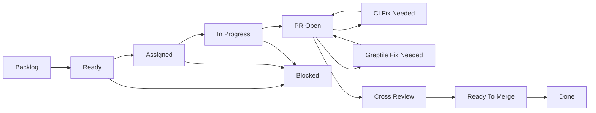

# GitHub Project Blueprint

## Purpose

The GitHub Project is the human-facing control tower for harness execution. It should show what can run now, what is blocked, which agent owns it, where review stands, and whether CI is healthy.

> [!TIP]
> The project should feel like an execution cockpit, not a generic backlog. Every field should answer a human question quickly: what is ready, who owns it, what is blocked, and what needs review?

## Project

Suggested project name:

```text
Voice Transcription Harness Execution
```

Suggested description:

```text
Dependency-aware execution board for building the native Windows 11 voice transcription app through Codex, Claude Code, Greptile review, CI, and human oversight.
```

## Fields

| Field | Type | Values |
| --- | --- | --- |
| Status | Single select | Backlog, Ready, Assigned, In Progress, PR Open, CI Fix Needed, Greptile Fix Needed, Cross Review, Ready To Merge, Done, Blocked |
| Phase | Single select | Harness, Foundation, Recording, Providers, UI Polish, Release |
| Agent | Single select | Codex, Claude Code, Either, Human |
| Reasoning | Single select | Low, Medium, High, Extra High |
| Parallel Group | Text | e.g. `foundation`, `providers-parallel`, `hud-implementation` |
| Blocked By | Text | Harness IDs or GitHub issue links |
| Review State | Single select | Not Started, Greptile Pending, Greptile Fix Needed, Cross Review Pending, Human Review Needed, Approved |
| CI State | Single select | Not Run, Passing, Failing, Fix In Progress, Waived |
| PR | Text | Pull request URL |

<details>
<summary>Field intent</summary>

| Field | Human question answered |
| --- | --- |
| Status | Where is this work in the delivery flow? |
| Phase | Which part of the product/harness does this belong to? |
| Agent | Who or what should work on it? |
| Reasoning | How much thinking budget should the worker use? |
| Parallel Group | What can run together without stepping on dependencies? |
| Blocked By | Why is this not ready yet? |
| Review State | What review action is still pending? |
| CI State | Is automated validation healthy? |
| PR | Where is the implementation? |

</details>

## Views



### Execution Board

Board grouped by `Status`.

Columns:

1. Backlog
2. Ready
3. Assigned
4. In Progress
5. PR Open
6. CI Fix Needed
7. Greptile Fix Needed
8. Cross Review
9. Ready To Merge
10. Done
11. Blocked

This is the primary live-stream view.

### Parallel Work

Table grouped by `Parallel Group`, sorted by `Phase`.

Use this view to identify safe parallel execution batches.

### Agent Load

Board grouped by `Agent`.

Use this view to see Codex, Claude Code, Either, and Human queues.

### Review Queue

Table filtered to:

```text
Status is PR Open or CI Fix Needed or Greptile Fix Needed or Cross Review or Ready To Merge
```

Columns should include Review State, CI State, PR, Agent, and Blocked By.

### Critical Path

Table filtered to:

```text
Labels include priority:p0
```

Sorted by Phase, then dependency order.

## Example Row

| Field | Example |
| --- | --- |
| Title | VT-020 Define HUD state machine before visual implementation |
| Status | Ready |
| Phase | Recording |
| Agent | Codex |
| Reasoning | Medium |
| Parallel Group | `hud-design` |
| Blocked By | VT-003, VT-006, VT-008 |
| Review State | Not Started |
| CI State | Not Run |
| PR | empty |

## Automation Rules

Start simple:

- New generated issues enter `Backlog`.
- Issues with no unresolved dependencies move to `Ready`.
- When assigned to a tmux worker, move to `Assigned`.
- When a worker reports active work, move to `In Progress`.
- When a PR opens, move to `PR Open`.
- Failed CI moves to `CI Fix Needed`.
- Greptile findings move to `Greptile Fix Needed`.
- Cross-agent review moves to `Cross Review`.
- Passing CI, handled Greptile findings, and completed cross-review move to `Ready To Merge`.
- Merge moves to `Done`.

Automation can be manual at first. Scripted Project updates should come after labels, milestones, and issue apply mode are proven.

## Setup Checklist

- [ ] Create the Project.
- [ ] Add fields from the table above.
- [ ] Create the five views above.
- [ ] Apply generated labels and milestones.
- [ ] Apply generated issues.
- [ ] Add generated issues to the Project.
- [ ] Manually set the first dependency-free issues to `Ready`.
- [ ] Keep Project automation manual until the issue apply path is proven.
