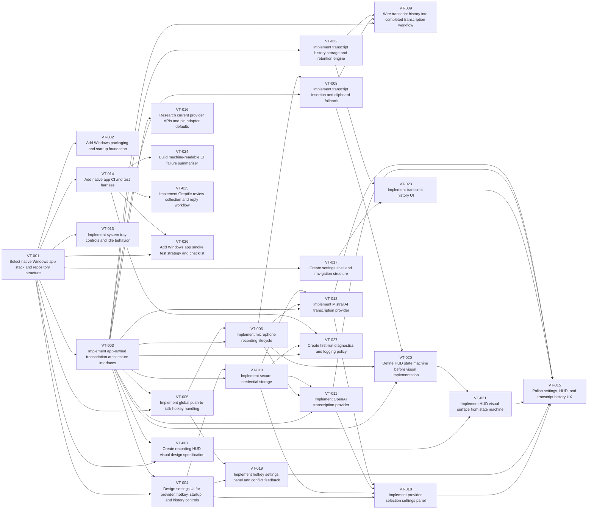

# Generated Harness Plan

Source: `docs/requirements.md`

This is a dry-run plan. It has not created GitHub issues or projects.

> [!TIP]
> Each generated issue includes a recommended model, reasoning effort, dependency diagram,
> implementation checklist, constraints, failure modes, and worker prompt. The intent is
> to pay planning cost up front so lower/medium-effort workers can execute safely.

> [!IMPORTANT]
> This generated plan is a deterministic sample and regression fixture. The intended
> production workflow uses GPT-5.5 extra-high reasoning through the local Codex CLI
> to perform decomposition, Claude Code Opus 4.8 extra-high effort to critique it,
> and Codex extra-high to reconcile the critique before validation/render/apply.

## Dependency Map



## Issues By Phase

### phase:1

| ID | Title | Agent | Dependencies | Parallel Group |
| --- | --- | --- | --- | --- |
| VT-001 | Select native Windows app stack and repository structure | `codex` / `medium` | None | `foundation` |
| VT-002 | Add Windows packaging and startup foundation | `codex` / `medium` | VT-001 | `foundation` |
| VT-003 | Implement app-owned transcription architecture interfaces | `codex` / `medium` | VT-001 | `foundation` |
| VT-004 | Design settings UI for provider, hotkey, startup, and history controls | `claude` / `medium` | VT-001, VT-003 | `foundation-parallel` |
| VT-013 | Implement system tray controls and idle behavior | `codex` / `low` | VT-001 | `foundation-parallel` |
| VT-017 | Create settings shell and navigation structure | `claude` / `medium` | VT-001 | `settings-ui` |

### phase:2

| ID | Title | Agent | Dependencies | Parallel Group |
| --- | --- | --- | --- | --- |
| VT-005 | Implement global push-to-talk hotkey handling | `codex` / `medium` | VT-001, VT-003 | `recording` |
| VT-006 | Implement microphone recording lifecycle | `codex` / `medium` | VT-003, VT-005 | `recording` |
| VT-007 | Create recording HUD visual design specification | `claude` / `medium` | VT-001, VT-003 | `recording-parallel` |
| VT-008 | Implement transcript insertion and clipboard fallback | `codex` / `medium` | VT-003, VT-006 | `insertion` |
| VT-022 | Implement transcript history storage and retention engine | `codex` / `low` | VT-003 | `history-engine` |
| VT-009 | Wire transcript history into completed transcription workflow | `codex` / `low` | VT-003, VT-008, VT-022 | `history` |
| VT-019 | Implement hotkey settings panel and conflict feedback | `claude` / `medium` | VT-004, VT-005 | `hotkey-settings` |
| VT-020 | Define HUD state machine before visual implementation | `codex` / `medium` | VT-003, VT-006, VT-008 | `hud-design` |
| VT-021 | Implement HUD visual surface from state machine | `claude` / `medium` | VT-007, VT-020 | `hud-implementation` |
| VT-023 | Implement transcript history UI | `claude` / `medium` | VT-017, VT-022 | `history-ui` |

### phase:3

| ID | Title | Agent | Dependencies | Parallel Group |
| --- | --- | --- | --- | --- |
| VT-010 | Implement secure credential storage | `codex` / `medium` | VT-003, VT-004 | `providers` |
| VT-011 | Implement OpenAI transcription provider | `codex` / `medium` | VT-003, VT-006, VT-010 | `providers-parallel` |
| VT-012 | Implement Mistral AI transcription provider | `codex` / `low` | VT-003, VT-006, VT-010 | `providers-parallel` |
| VT-018 | Implement provider selection settings panel | `claude` / `medium` | VT-004, VT-010, VT-011, VT-012 | `provider-settings` |
| VT-016 | Research current provider APIs and pin adapter defaults | `codex` / `medium` | VT-003 | `providers-research` |

### phase:4

| ID | Title | Agent | Dependencies | Parallel Group |
| --- | --- | --- | --- | --- |
| VT-014 | Add native app CI and test harness | `codex` / `medium` | VT-001 | `release` |
| VT-015 | Polish settings, HUD, and transcript history UX | `claude` / `medium` | VT-018, VT-019, VT-021, VT-023, VT-011, VT-012 | `release` |
| VT-024 | Build machine-readable CI failure summarizer | `codex` / `medium` | VT-014 | `ci-foundation` |
| VT-025 | Implement Greptile review collection and reply workflow | `codex` / `low` | VT-014 | `review-automation` |
| VT-026 | Add Windows app smoke test strategy and checklist | `codex` / `medium` | VT-001, VT-014 | `testing-strategy` |
| VT-027 | Create first-run diagnostics and logging policy | `codex` / `low` | VT-003, VT-010, VT-014 | `diagnostics` |

## Apply

Review `plan.json` and issue markdown first. To apply later:

```sh
python3 scripts/github_apply_plan.py --plan generated/harness-plan/plan.json --apply
```
