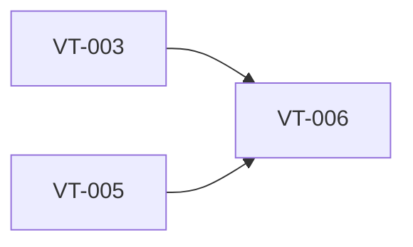

# Implement microphone recording lifecycle

> Harness ID: `VT-006`

> [!IMPORTANT]
> This issue is designed for a lower/medium-effort worker. Do not re-plan the product.
> Execute the prescribed scope, keep the PR focused, and escalate only for material product,
> security, architecture, CI, or UX decisions.

## Outcome

Capture audio from the default microphone for push-to-talk transcription.

## Work Metadata

| Field | Value |
| --- | --- |
| Milestone | M2 Recording And Insertion Workflow |
| Phase | `phase:2` |
| Parallel Group | `recording` |
| Recommended Agent | `agent:codex` |
| Recommended Model | GPT-5.5 via local Codex CLI, low-to-medium reasoning |
| Reasoning Effort | `medium` |
| Agent Command | `codex` |
| Dependencies | `VT-003`, `VT-005` |
| Labels | `type:implementation`, `area:windows-app`, `agent:codex`, `phase:2`, `priority:p0`, `ci:required`, `review:cross-agent` |

## Dependency View



## Scope

- [ ] Start/stop recording follows hotkey state.
- [ ] Missing microphone permission or device failure produces clear errors.
- [ ] Audio is not retained by default after transcription completes.

## Prescribed Implementation Plan

- [ ] Read docs/requirements.md and relevant ADRs before editing.
- [ ] Inspect existing code and tests before choosing an implementation shape.
- [ ] Implement: Start/stop recording follows hotkey state.
- [ ] Implement: Missing microphone permission or device failure produces clear errors.
- [ ] Implement: Audio is not retained by default after transcription completes.
- [ ] Verify: Recorder exposes audio data in the provider-required format or through a conversion path.
- [ ] Verify: Cancellation and failure are handled.
- [ ] Verify: Audio level information is available for the HUD where feasible.
- [ ] Run the issue-specific test command and record the result in the PR.
- [ ] Open a focused PR that closes only this issue unless the issue explicitly says otherwise.

## Expected Files Or Areas

- `src/**`
- `tests/**`
- `docs/** when implementation choices need explanation`

## Acceptance Criteria

- [ ] Recorder exposes audio data in the provider-required format or through a conversion path.
- [ ] Cancellation and failure are handled.
- [ ] Audio level information is available for the HUD where feasible.

## Constraints

- Do not make unrelated refactors.
- Do not introduce paid model API calls for orchestration.
- Preserve user changes and generated harness IDs.
- If a decision is low-risk and reversible, use judgment and document it.
- Keep the implementation native Windows 11; do not introduce Electron or a browser-wrapper shell.

<details>
<summary>Failure modes and escalation rules</summary>

- Acceptance criteria are ambiguous after reading the requirements.
- Required local or Windows-side tool is missing.
- Implementation requires a product/security/architecture decision not already recorded.

If one of these occurs, stop and report:

```text
HARNESS_STATUS: blocked
BLOCKER: <specific blocker>
NEEDED_DECISION: <yes|no>
```

</details>

## Review Plan

- [ ] Codex reviews recording lifecycle and cleanup.
- [ ] Claude reviews error visibility requirements.

## CI Expectations

- [ ] Recorder tests or documented manual smoke test exists.

## Notes

- None

## Agent Handoff

When assigned, create a branch named `work/vt-006-implement-microphone-recording-lifecycle` and open a PR that links this issue.

Use this worker prompt:

```text
You are working on VT-006: Implement microphone recording lifecycle.

Recommended model/effort: GPT-5.5 via local Codex CLI, low-to-medium reasoning / medium.
Primary objective: Capture audio from the default microphone for push-to-talk transcription.

Read:
- docs/requirements.md
- docs/decisions/0001-app-owned-transcription-integration.md
- This issue body

Do only this issue's scope. Make the smallest coherent change. Run the listed CI/test expectations.
Open a PR that closes this issue and include test output plus Greptile/cross-agent review status.
```

Final worker response should include:

```text
HARNESS_STATUS: complete|blocked|needs_review
BRANCH: <branch>
PR: <url-or-none>
SUMMARY: <one line>
```
