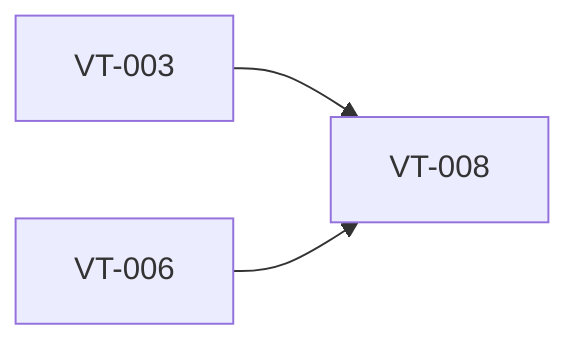

# Implement transcript insertion and clipboard fallback

> Harness ID: `VT-008`

> [!IMPORTANT]
> This issue is designed for a lower/medium-effort worker. Do not re-plan the product.
> Execute the prescribed scope, keep the PR focused, and escalate only for material product,
> security, architecture, CI, or UX decisions.

## Outcome

Insert final transcripts into the active text target and fall back to clipboard on failure.

## Work Metadata

| Field | Value |
| --- | --- |
| Milestone | M2 Recording And Insertion Workflow |
| Phase | `phase:2` |
| Parallel Group | `insertion` |
| Recommended Agent | `agent:codex` |
| Recommended Model | GPT-5.5 via local Codex CLI, low-to-medium reasoning |
| Reasoning Effort | `medium` |
| Agent Command | `codex` |
| Dependencies | `VT-003`, `VT-006` |
| Labels | `type:implementation`, `area:windows-app`, `agent:codex`, `phase:2`, `priority:p0`, `ci:required`, `review:cross-agent` |

## Dependency View



## Scope

- [ ] Active text insertion is the default delivery path.
- [ ] Clipboard fallback runs when insertion fails.
- [ ] Fallback is visible to the user and history retains the transcript.

## Prescribed Implementation Plan

- [ ] Read docs/requirements.md and relevant ADRs before editing.
- [ ] Inspect existing code and tests before choosing an implementation shape.
- [ ] Implement: Active text insertion is the default delivery path.
- [ ] Implement: Clipboard fallback runs when insertion fails.
- [ ] Implement: Fallback is visible to the user and history retains the transcript.
- [ ] Verify: Insertion adapter has a clear success/failure contract.
- [ ] Verify: Clipboard fallback is tested or manually smoke-tested.
- [ ] Verify: Failure does not drop transcript text.
- [ ] Run the issue-specific test command and record the result in the PR.
- [ ] Open a focused PR that closes only this issue unless the issue explicitly says otherwise.

## Expected Files Or Areas

- `src/**`
- `tests/**`
- `docs/** when implementation choices need explanation`

## Acceptance Criteria

- [ ] Insertion adapter has a clear success/failure contract.
- [ ] Clipboard fallback is tested or manually smoke-tested.
- [ ] Failure does not drop transcript text.

## Constraints

- Do not make unrelated refactors.
- Do not introduce paid model API calls for orchestration.
- Preserve user changes and generated harness IDs.
- If a decision is low-risk and reversible, use judgment and document it.
- Keep the implementation native Windows 11; do not introduce Electron or a browser-wrapper shell.

<details>
<summary>Failure modes and escalation rules</summary>

- Acceptance criteria are ambiguous after reading the requirements.
- Required local or Windows-side tool is missing.
- Implementation requires a product/security/architecture decision not already recorded.

If one of these occurs, stop and report:

```text
HARNESS_STATUS: blocked
BLOCKER: <specific blocker>
NEEDED_DECISION: <yes|no>
```

</details>

## Review Plan

- [ ] Codex reviews Windows insertion behavior.
- [ ] Claude reviews fallback notification UX.

## CI Expectations

- [ ] Tests cover insertion success and fallback paths where feasible.

## Notes

- None

## Agent Handoff

When assigned, create a branch named `work/vt-008-implement-transcript-insertion-and-clipboard-fallback` and open a PR that links this issue.

Use this worker prompt:

```text
You are working on VT-008: Implement transcript insertion and clipboard fallback.

Recommended model/effort: GPT-5.5 via local Codex CLI, low-to-medium reasoning / medium.
Primary objective: Insert final transcripts into the active text target and fall back to clipboard on failure.

Read:
- docs/requirements.md
- docs/decisions/0001-app-owned-transcription-integration.md
- This issue body

Do only this issue's scope. Make the smallest coherent change. Run the listed CI/test expectations.
Open a PR that closes this issue and include test output plus Greptile/cross-agent review status.
```

Final worker response should include:

```text
HARNESS_STATUS: complete|blocked|needs_review
BRANCH: <branch>
PR: <url-or-none>
SUMMARY: <one line>
```
