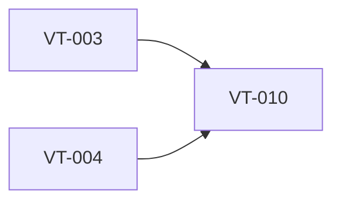

# Implement secure credential storage

> Harness ID: `VT-010`

> [!IMPORTANT]
> This issue is designed for a lower/medium-effort worker. Do not re-plan the product.
> Execute the prescribed scope, keep the PR focused, and escalate only for material product,
> security, architecture, CI, or UX decisions.

## Outcome

Store provider API keys using Windows-native secure credential storage.

## Work Metadata

| Field | Value |
| --- | --- |
| Milestone | M3 Provider Integrations |
| Phase | `phase:3` |
| Parallel Group | `providers` |
| Recommended Agent | `agent:codex` |
| Recommended Model | GPT-5.5 via local Codex CLI, medium reasoning; escalate to high for architecture/security/API uncertainty |
| Reasoning Effort | `medium` |
| Agent Command | `codex` |
| Dependencies | `VT-003`, `VT-004` |
| Labels | `type:implementation`, `area:provider`, `agent:codex`, `phase:3`, `priority:p0`, `ci:required`, `review:cross-agent` |

## Dependency View



## Scope

- [ ] API keys are entered through settings.
- [ ] Keys are not stored in plain-text app configuration.
- [ ] Credential failures are surfaced clearly.

## Prescribed Implementation Plan

- [ ] Read docs/requirements.md and relevant ADRs before editing.
- [ ] Inspect existing code and tests before choosing an implementation shape.
- [ ] Implement: API keys are entered through settings.
- [ ] Implement: Keys are not stored in plain-text app configuration.
- [ ] Implement: Credential failures are surfaced clearly.
- [ ] Verify: Credential storage uses Windows Credential Manager or equivalent Windows-native secure storage.
- [ ] Verify: Provider adapters can retrieve keys without exposing them in logs.
- [ ] Verify: Deleting a provider credential is supported.
- [ ] Run the issue-specific test command and record the result in the PR.
- [ ] Open a focused PR that closes only this issue unless the issue explicitly says otherwise.

## Expected Files Or Areas

- `src/** provider files`
- `tests/** provider tests`
- `docs/** provider notes when needed`

## Acceptance Criteria

- [ ] Credential storage uses Windows Credential Manager or equivalent Windows-native secure storage.
- [ ] Provider adapters can retrieve keys without exposing them in logs.
- [ ] Deleting a provider credential is supported.

## Constraints

- Do not make unrelated refactors.
- Do not introduce paid model API calls for orchestration.
- Preserve user changes and generated harness IDs.
- If a decision is low-risk and reversible, use judgment and document it.
- Do not bind UI workflow directly to one provider API shape.
- Do not log credentials, raw audio, or full transcripts by default.

<details>
<summary>Failure modes and escalation rules</summary>

- Acceptance criteria are ambiguous after reading the requirements.
- Required local or Windows-side tool is missing.
- Implementation requires a product/security/architecture decision not already recorded.
- Provider docs or model names conflict with the recorded requirements; verify official docs before coding.

If one of these occurs, stop and report:

```text
HARNESS_STATUS: blocked
BLOCKER: <specific blocker>
NEEDED_DECISION: <yes|no>
```

</details>

## Review Plan

- [ ] Codex reviews security boundary.
- [ ] Claude reviews settings clarity around saved credentials.

## CI Expectations

- [ ] Credential storage behavior has tests or documented manual verification.

## Notes

- None

## Agent Handoff

When assigned, create a branch named `work/vt-010-implement-secure-credential-storage` and open a PR that links this issue.

Use this worker prompt:

```text
You are working on VT-010: Implement secure credential storage.

Recommended model/effort: GPT-5.5 via local Codex CLI, medium reasoning; escalate to high for architecture/security/API uncertainty / medium.
Primary objective: Store provider API keys using Windows-native secure credential storage.

Read:
- docs/requirements.md
- docs/decisions/0001-app-owned-transcription-integration.md
- This issue body

Do only this issue's scope. Make the smallest coherent change. Run the listed CI/test expectations.
Open a PR that closes this issue and include test output plus Greptile/cross-agent review status.
```

Final worker response should include:

```text
HARNESS_STATUS: complete|blocked|needs_review
BRANCH: <branch>
PR: <url-or-none>
SUMMARY: <one line>
```
