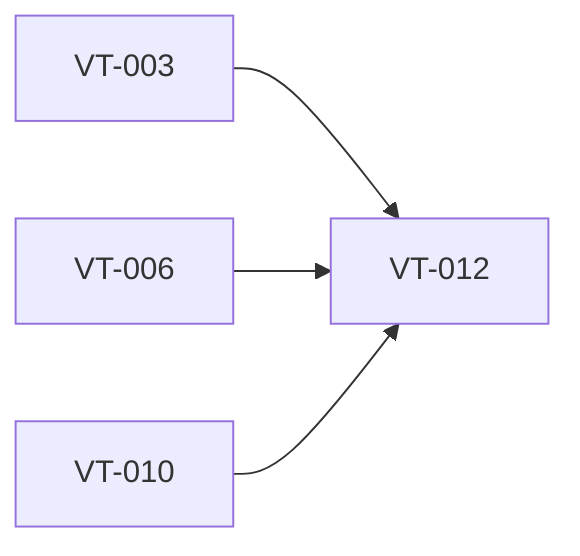

# Implement Mistral AI transcription provider

> Harness ID: `VT-012`

> [!IMPORTANT]
> This issue is designed for a lower/medium-effort worker. Do not re-plan the product.
> Execute the prescribed scope, keep the PR focused, and escalate only for material product,
> security, architecture, CI, or UX decisions.

## Outcome

Integrate Mistral AI transcription through the provider abstraction.

## Work Metadata

| Field | Value |
| --- | --- |
| Milestone | M3 Provider Integrations |
| Phase | `phase:3` |
| Parallel Group | `providers-parallel` |
| Recommended Agent | `agent:codex` |
| Recommended Model | GPT-5.5 via local Codex CLI, medium reasoning; escalate to high for architecture/security/API uncertainty |
| Reasoning Effort | `low` |
| Agent Command | `codex` |
| Dependencies | `VT-003`, `VT-006`, `VT-010` |
| Labels | `type:implementation`, `area:provider`, `agent:codex`, `phase:3`, `priority:p1`, `ci:required`, `review:cross-agent` |

## Dependency View



## Scope

- [ ] Use the latest best Mistral transcription direction from official docs.
- [ ] Support configured API key retrieval.
- [ ] Normalize provider errors.
- [ ] Support cancellation where possible.

## Prescribed Implementation Plan

- [ ] Read docs/requirements.md and relevant ADRs before editing.
- [ ] Inspect existing code and tests before choosing an implementation shape.
- [ ] Implement: Use the latest best Mistral transcription direction from official docs.
- [ ] Implement: Support configured API key retrieval.
- [ ] Implement: Normalize provider errors.
- [ ] Implement: Support cancellation where possible.
- [ ] Verify: Mistral provider implements the common provider contract.
- [ ] Verify: Provider can be selected as the active provider.
- [ ] Verify: Network and credential failures are user-visible and not logged with secrets.
- [ ] Run the issue-specific test command and record the result in the PR.
- [ ] Open a focused PR that closes only this issue unless the issue explicitly says otherwise.

## Expected Files Or Areas

- `src/** provider files`
- `tests/** provider tests`
- `docs/** provider notes when needed`

## Acceptance Criteria

- [ ] Mistral provider implements the common provider contract.
- [ ] Provider can be selected as the active provider.
- [ ] Network and credential failures are user-visible and not logged with secrets.

## Constraints

- Do not make unrelated refactors.
- Do not introduce paid model API calls for orchestration.
- Preserve user changes and generated harness IDs.
- If a decision is low-risk and reversible, use judgment and document it.
- Do not bind UI workflow directly to one provider API shape.
- Do not log credentials, raw audio, or full transcripts by default.

<details>
<summary>Failure modes and escalation rules</summary>

- Acceptance criteria are ambiguous after reading the requirements.
- Required local or Windows-side tool is missing.
- Implementation requires a product/security/architecture decision not already recorded.
- Provider docs or model names conflict with the recorded requirements; verify official docs before coding.

If one of these occurs, stop and report:

```text
HARNESS_STATUS: blocked
BLOCKER: <specific blocker>
NEEDED_DECISION: <yes|no>
```

</details>

## Review Plan

- [ ] Codex reviews API integration and error normalization.
- [ ] Claude reviews user-facing provider error messages.

## CI Expectations

- [ ] Provider contract tests or mocked integration tests exist.

## Notes

- None

## Agent Handoff

When assigned, create a branch named `work/vt-012-implement-mistral-ai-transcription-provider` and open a PR that links this issue.

Use this worker prompt:

```text
You are working on VT-012: Implement Mistral AI transcription provider.

Recommended model/effort: GPT-5.5 via local Codex CLI, medium reasoning; escalate to high for architecture/security/API uncertainty / low.
Primary objective: Integrate Mistral AI transcription through the provider abstraction.

Read:
- docs/requirements.md
- docs/decisions/0001-app-owned-transcription-integration.md
- This issue body

Do only this issue's scope. Make the smallest coherent change. Run the listed CI/test expectations.
Open a PR that closes this issue and include test output plus Greptile/cross-agent review status.
```

Final worker response should include:

```text
HARNESS_STATUS: complete|blocked|needs_review
BRANCH: <branch>
PR: <url-or-none>
SUMMARY: <one line>
```
