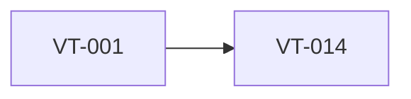

# Add native app CI and test harness

> Harness ID: `VT-014`

> [!IMPORTANT]
> This issue is designed for a lower/medium-effort worker. Do not re-plan the product.
> Execute the prescribed scope, keep the PR focused, and escalate only for material product,
> security, architecture, CI, or UX decisions.

## Outcome

Create fast Windows app CI with agent-readable failure summaries.

## Work Metadata

| Field | Value |
| --- | --- |
| Milestone | M4 Polish And Release Readiness |
| Phase | `phase:4` |
| Parallel Group | `release` |
| Recommended Agent | `agent:codex` |
| Recommended Model | GPT-5.5 via local Codex CLI, medium reasoning; escalate to high for architecture/security/API uncertainty |
| Reasoning Effort | `medium` |
| Agent Command | `codex` |
| Dependencies | `VT-001` |
| Labels | `type:testing`, `area:ci`, `agent:codex`, `phase:4`, `priority:p0`, `ci:required`, `review:cross-agent` |

## Dependency View



## Scope

- [ ] Define unit, integration, UI smoke, and packaging validation layers.
- [ ] Keep CI economical and segmented.
- [ ] Emit concise machine-readable failure summaries.

## Prescribed Implementation Plan

- [ ] Read docs/requirements.md and relevant ADRs before editing.
- [ ] Inspect existing code and tests before choosing an implementation shape.
- [ ] Implement: Define unit, integration, UI smoke, and packaging validation layers.
- [ ] Implement: Keep CI economical and segmented.
- [ ] Implement: Emit concise machine-readable failure summaries.
- [ ] Verify: CI runs harness validation and app tests appropriate to the current scaffold.
- [ ] Verify: Failure artifact points to failing check, files, and likely owner.
- [ ] Verify: Logs are segmented and not unnecessarily noisy.
- [ ] Run the issue-specific test command and record the result in the PR.
- [ ] Open a focused PR that closes only this issue unless the issue explicitly says otherwise.

## Expected Files Or Areas

- `.github/workflows/**`
- `scripts/**`
- `docs/harness/ci-strategy.md`

## Acceptance Criteria

- [ ] CI runs harness validation and app tests appropriate to the current scaffold.
- [ ] Failure artifact points to failing check, files, and likely owner.
- [ ] Logs are segmented and not unnecessarily noisy.

## Constraints

- Do not make unrelated refactors.
- Do not introduce paid model API calls for orchestration.
- Preserve user changes and generated harness IDs.
- If a decision is low-risk and reversible, use judgment and document it.
- CI logs must stay segmented and concise; add machine-readable summaries for failures.

<details>
<summary>Failure modes and escalation rules</summary>

- Acceptance criteria are ambiguous after reading the requirements.
- Required local or Windows-side tool is missing.
- Implementation requires a product/security/architecture decision not already recorded.
- CI produces noisy logs or lacks a machine-readable failure artifact.

If one of these occurs, stop and report:

```text
HARNESS_STATUS: blocked
BLOCKER: <specific blocker>
NEEDED_DECISION: <yes|no>
```

</details>

## Review Plan

- [ ] Codex reviews CI correctness.
- [ ] Claude reviews human readability of CI output.

## CI Expectations

- [ ] GitHub Actions workflow passes on the repository.

## Notes

- None

## Agent Handoff

When assigned, create a branch named `work/vt-014-add-native-app-ci-and-test-harness` and open a PR that links this issue.

Use this worker prompt:

```text
You are working on VT-014: Add native app CI and test harness.

Recommended model/effort: GPT-5.5 via local Codex CLI, medium reasoning; escalate to high for architecture/security/API uncertainty / medium.
Primary objective: Create fast Windows app CI with agent-readable failure summaries.

Read:
- docs/requirements.md
- docs/decisions/0001-app-owned-transcription-integration.md
- This issue body

Do only this issue's scope. Make the smallest coherent change. Run the listed CI/test expectations.
Open a PR that closes this issue and include test output plus Greptile/cross-agent review status.
```

Final worker response should include:

```text
HARNESS_STATUS: complete|blocked|needs_review
BRANCH: <branch>
PR: <url-or-none>
SUMMARY: <one line>
```
