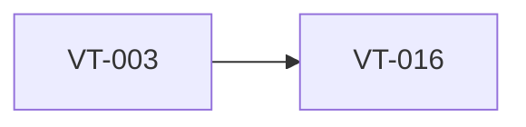

# Research current provider APIs and pin adapter defaults

> Harness ID: `VT-016`

> [!IMPORTANT]
> This issue is designed for a lower/medium-effort worker. Do not re-plan the product.
> Execute the prescribed scope, keep the PR focused, and escalate only for material product,
> security, architecture, CI, or UX decisions.

## Outcome

Verify current OpenAI and Mistral transcription docs immediately before provider implementation and record adapter defaults.

## Work Metadata

| Field | Value |
| --- | --- |
| Milestone | M3 Provider Integrations |
| Phase | `phase:3` |
| Parallel Group | `providers-research` |
| Recommended Agent | `agent:codex` |
| Recommended Model | GPT-5.5 via local Codex CLI, medium reasoning; escalate to high for architecture/security/API uncertainty |
| Reasoning Effort | `medium` |
| Agent Command | `codex` |
| Dependencies | `VT-003` |
| Labels | `type:research`, `area:provider`, `agent:codex`, `phase:3`, `priority:p0`, `ci:required`, `review:cross-agent` |

## Dependency View



## Scope

- [ ] Check official OpenAI transcription and realtime transcription docs.
- [ ] Check official Mistral audio transcription docs.
- [ ] Record selected endpoint, model alias, audio format, and streaming support for each provider.
- [ ] Add source links and date checked to provider documentation.

## Prescribed Implementation Plan

- [ ] Use official provider docs only; do not rely on memory for model names or endpoints.
- [ ] Create provider research notes with endpoint, model, audio format, auth, streaming, cancellation, and known errors.
- [ ] Update generated issue notes or provider docs if the requirements need a non-product correction.
- [ ] Run harness validation.

## Expected Files Or Areas

- `docs/providers/**`
- `docs/harness/** if workflow guidance changes`

## Acceptance Criteria

- [ ] Provider implementation tickets have current model/API facts available.
- [ ] No provider adapter relies on stale remembered API details.
- [ ] Docs explain whether each provider supports batch, streaming, cancellation, and error normalization.

## Constraints

- Do not make unrelated refactors.
- Do not introduce paid model API calls for orchestration.
- Preserve user changes and generated harness IDs.
- If a decision is low-risk and reversible, use judgment and document it.
- Do not bind UI workflow directly to one provider API shape.
- Do not log credentials, raw audio, or full transcripts by default.

<details>
<summary>Failure modes and escalation rules</summary>

- Acceptance criteria are ambiguous after reading the requirements.
- Required local or Windows-side tool is missing.
- Implementation requires a product/security/architecture decision not already recorded.
- Provider docs or model names conflict with the recorded requirements; verify official docs before coding.

If one of these occurs, stop and report:

```text
HARNESS_STATUS: blocked
BLOCKER: <specific blocker>
NEEDED_DECISION: <yes|no>
```

</details>

## Review Plan

- [ ] Codex reviews source accuracy and API implications.
- [ ] Claude reviews user-facing provider wording implications.

## CI Expectations

- [ ] Harness validation passes.
- [ ] Provider documentation includes official source links.

## Notes

- None

## Agent Handoff

When assigned, create a branch named `work/vt-016-research-current-provider-apis-and-pin-adapter-defaults` and open a PR that links this issue.

Use this worker prompt:

```text
You are working on VT-016: Research current provider APIs and pin adapter defaults.

Recommended model/effort: GPT-5.5 via local Codex CLI, medium reasoning; escalate to high for architecture/security/API uncertainty / medium.
Primary objective: Verify current OpenAI and Mistral transcription docs immediately before provider implementation and record adapter defaults.

Read:
- docs/requirements.md
- docs/decisions/0001-app-owned-transcription-integration.md
- This issue body

Do only this issue's scope. Make the smallest coherent change. Run the listed CI/test expectations.
Open a PR that closes this issue and include test output plus Greptile/cross-agent review status.
```

Final worker response should include:

```text
HARNESS_STATUS: complete|blocked|needs_review
BRANCH: <branch>
PR: <url-or-none>
SUMMARY: <one line>
```
