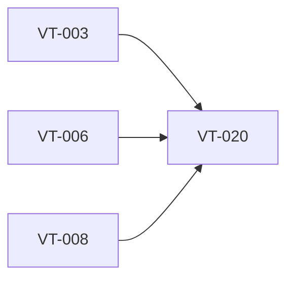

# Define HUD state machine before visual implementation

> Harness ID: `VT-020`

> [!IMPORTANT]
> This issue is designed for a lower/medium-effort worker. Do not re-plan the product.
> Execute the prescribed scope, keep the PR focused, and escalate only for material product,
> security, architecture, CI, or UX decisions.

## Outcome

Define the HUD state machine so visual implementation does not invent workflow behavior.

## Work Metadata

| Field | Value |
| --- | --- |
| Milestone | M2 Recording And Insertion Workflow |
| Phase | `phase:2` |
| Parallel Group | `hud-design` |
| Recommended Agent | `agent:codex` |
| Recommended Model | GPT-5.5 via local Codex CLI, medium reasoning; escalate to high for architecture/security/API uncertainty |
| Reasoning Effort | `medium` |
| Agent Command | `codex` |
| Dependencies | `VT-003`, `VT-006`, `VT-008` |
| Labels | `type:foundation`, `area:ui`, `area:windows-app`, `agent:codex`, `phase:2`, `priority:p0`, `ci:required`, `review:cross-agent` |

## Dependency View



## Scope

- [ ] Define idle, preparing, recording, transcribing, inserting, fallback, error, and completed states.
- [ ] Define transitions, cancellation behavior, and auto-dismiss triggers.
- [ ] Define data each state exposes to the UI.

## Prescribed Implementation Plan

- [ ] Read docs/requirements.md and relevant ADRs before editing.
- [ ] Inspect existing code and tests before choosing an implementation shape.
- [ ] Implement: Define idle, preparing, recording, transcribing, inserting, fallback, error, and completed states.
- [ ] Implement: Define transitions, cancellation behavior, and auto-dismiss triggers.
- [ ] Implement: Define data each state exposes to the UI.
- [ ] Verify: HUD implementation can follow the state machine without product guesswork.
- [ ] Verify: Auto-dismiss happens only after insertion or fallback notification is complete.
- [ ] Verify: Error states preserve transcript text when available.
- [ ] Run the issue-specific test command and record the result in the PR.
- [ ] Open a focused PR that closes only this issue unless the issue explicitly says otherwise.

## Expected Files Or Areas

- `src/** UI files`
- `docs/**/*.md for UI verification notes`
- `tests/** UI smoke artifacts when available`

## Acceptance Criteria

- [ ] HUD implementation can follow the state machine without product guesswork.
- [ ] Auto-dismiss happens only after insertion or fallback notification is complete.
- [ ] Error states preserve transcript text when available.

## Constraints

- Do not make unrelated refactors.
- Do not introduce paid model API calls for orchestration.
- Preserve user changes and generated harness IDs.
- If a decision is low-risk and reversible, use judgment and document it.
- Keep the implementation native Windows 11; do not introduce Electron or a browser-wrapper shell.
- Follow native Windows 11/Fluent patterns; avoid marketing-page composition.
- Text and controls must fit at common Windows desktop scaling settings.

<details>
<summary>Failure modes and escalation rules</summary>

- Acceptance criteria are ambiguous after reading the requirements.
- Required local or Windows-side tool is missing.
- Implementation requires a product/security/architecture decision not already recorded.
- Visual behavior cannot be verified without a running Windows UI; attach a manual verification checklist.

If one of these occurs, stop and report:

```text
HARNESS_STATUS: blocked
BLOCKER: <specific blocker>
NEEDED_DECISION: <yes|no>
```

</details>

## Review Plan

- [ ] Codex reviews state-machine completeness.
- [ ] Claude reviews whether states support clear UI.

## CI Expectations

- [ ] State-machine tests or documentation examples exist.

## Notes

- None

## Agent Handoff

When assigned, create a branch named `work/vt-020-define-hud-state-machine-before-visual-implementation` and open a PR that links this issue.

Use this worker prompt:

```text
You are working on VT-020: Define HUD state machine before visual implementation.

Recommended model/effort: GPT-5.5 via local Codex CLI, medium reasoning; escalate to high for architecture/security/API uncertainty / medium.
Primary objective: Define the HUD state machine so visual implementation does not invent workflow behavior.

Read:
- docs/requirements.md
- docs/decisions/0001-app-owned-transcription-integration.md
- This issue body

Do only this issue's scope. Make the smallest coherent change. Run the listed CI/test expectations.
Open a PR that closes this issue and include test output plus Greptile/cross-agent review status.
```

Final worker response should include:

```text
HARNESS_STATUS: complete|blocked|needs_review
BRANCH: <branch>
PR: <url-or-none>
SUMMARY: <one line>
```
