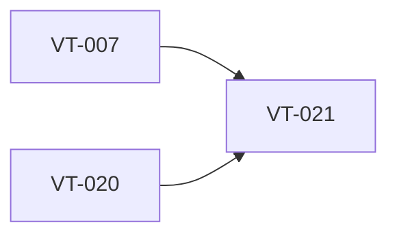

# Implement HUD visual surface from state machine

> Harness ID: `VT-021`

> [!IMPORTANT]
> This issue is designed for a lower/medium-effort worker. Do not re-plan the product.
> Execute the prescribed scope, keep the PR focused, and escalate only for material product,
> security, architecture, CI, or UX decisions.

## Outcome

Implement the HUD visual surface using the prescribed state machine.

## Work Metadata

| Field | Value |
| --- | --- |
| Milestone | M2 Recording And Insertion Workflow |
| Phase | `phase:2` |
| Parallel Group | `hud-implementation` |
| Recommended Agent | `agent:claude` |
| Recommended Model | Claude Code Sonnet, medium effort; use Opus/high only for visual system decisions or ambiguous UX tradeoffs |
| Reasoning Effort | `medium` |
| Agent Command | `claude` |
| Dependencies | `VT-007`, `VT-020` |
| Labels | `type:implementation`, `area:ui`, `agent:claude`, `phase:2`, `priority:p0`, `ci:required`, `review:cross-agent` |

## Dependency View



## Scope

- [ ] Render all HUD states from VT-020.
- [ ] Position centered near the lower screen and inset above the bottom edge.
- [ ] Show audio activity without layout shift.
- [ ] Keep the foreground application focus behavior intact.

## Prescribed Implementation Plan

- [ ] Read docs/requirements.md and relevant ADRs before editing.
- [ ] Inspect existing code and tests before choosing an implementation shape.
- [ ] Implement: Render all HUD states from VT-020.
- [ ] Implement: Position centered near the lower screen and inset above the bottom edge.
- [ ] Implement: Show audio activity without layout shift.
- [ ] Implement: Keep the foreground application focus behavior intact.
- [ ] Verify: HUD renders every state without text overlap.
- [ ] Verify: HUD does not behave like a modal dialog.
- [ ] Verify: HUD is visually consistent with Windows 11 surfaces.
- [ ] Run the issue-specific test command and record the result in the PR.
- [ ] Open a focused PR that closes only this issue unless the issue explicitly says otherwise.

## Expected Files Or Areas

- `src/** UI files`
- `docs/**/*.md for UI verification notes`
- `tests/** UI smoke artifacts when available`

## Acceptance Criteria

- [ ] HUD renders every state without text overlap.
- [ ] HUD does not behave like a modal dialog.
- [ ] HUD is visually consistent with Windows 11 surfaces.

## Constraints

- Do not make unrelated refactors.
- Do not introduce paid model API calls for orchestration.
- Preserve user changes and generated harness IDs.
- If a decision is low-risk and reversible, use judgment and document it.
- Follow native Windows 11/Fluent patterns; avoid marketing-page composition.
- Text and controls must fit at common Windows desktop scaling settings.

<details>
<summary>Failure modes and escalation rules</summary>

- Acceptance criteria are ambiguous after reading the requirements.
- Required local or Windows-side tool is missing.
- Implementation requires a product/security/architecture decision not already recorded.
- Visual behavior cannot be verified without a running Windows UI; attach a manual verification checklist.

If one of these occurs, stop and report:

```text
HARNESS_STATUS: blocked
BLOCKER: <specific blocker>
NEEDED_DECISION: <yes|no>
```

</details>

## Review Plan

- [ ] Claude reviews visual polish.
- [ ] Codex reviews state binding and focus behavior.

## CI Expectations

- [ ] UI smoke checklist or screenshot artifacts cover all states.

## Notes

- None

## Agent Handoff

When assigned, create a branch named `work/vt-021-implement-hud-visual-surface-from-state-machine` and open a PR that links this issue.

Use this worker prompt:

```text
You are working on VT-021: Implement HUD visual surface from state machine.

Recommended model/effort: Claude Code Sonnet, medium effort; use Opus/high only for visual system decisions or ambiguous UX tradeoffs / medium.
Primary objective: Implement the HUD visual surface using the prescribed state machine.

Read:
- docs/requirements.md
- docs/decisions/0001-app-owned-transcription-integration.md
- This issue body

Do only this issue's scope. Make the smallest coherent change. Run the listed CI/test expectations.
Open a PR that closes this issue and include test output plus Greptile/cross-agent review status.
```

Final worker response should include:

```text
HARNESS_STATUS: complete|blocked|needs_review
BRANCH: <branch>
PR: <url-or-none>
SUMMARY: <one line>
```
