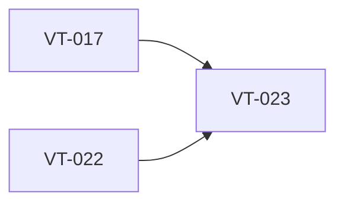

# Implement transcript history UI

> Harness ID: `VT-023`

> [!IMPORTANT]
> This issue is designed for a lower/medium-effort worker. Do not re-plan the product.
> Execute the prescribed scope, keep the PR focused, and escalate only for material product,
> security, architecture, CI, or UX decisions.

## Outcome

Implement the transcript history view and retention controls.

## Work Metadata

| Field | Value |
| --- | --- |
| Milestone | M2 Recording And Insertion Workflow |
| Phase | `phase:2` |
| Parallel Group | `history-ui` |
| Recommended Agent | `agent:claude` |
| Recommended Model | Claude Code Sonnet, medium effort; use Opus/high only for visual system decisions or ambiguous UX tradeoffs |
| Reasoning Effort | `medium` |
| Agent Command | `claude` |
| Dependencies | `VT-017`, `VT-022` |
| Labels | `type:implementation`, `area:ui`, `agent:claude`, `phase:2`, `priority:p2`, `ci:required`, `review:cross-agent` |

## Dependency View



## Scope

- [ ] Show recent transcript entries with provider and timestamp metadata.
- [ ] Support manual clear-history action.
- [ ] Expose retention setting with 30-day default.
- [ ] Avoid showing raw audio or credentials.

## Prescribed Implementation Plan

- [ ] Read docs/requirements.md and relevant ADRs before editing.
- [ ] Inspect existing code and tests before choosing an implementation shape.
- [ ] Implement: Show recent transcript entries with provider and timestamp metadata.
- [ ] Implement: Support manual clear-history action.
- [ ] Implement: Expose retention setting with 30-day default.
- [ ] Implement: Avoid showing raw audio or credentials.
- [ ] Verify: History UI is scannable and compact.
- [ ] Verify: Clear-history action is explicit and hard to trigger accidentally.
- [ ] Verify: Retention control is understandable without long explanatory text.
- [ ] Run the issue-specific test command and record the result in the PR.
- [ ] Open a focused PR that closes only this issue unless the issue explicitly says otherwise.

## Expected Files Or Areas

- `src/** UI files`
- `docs/**/*.md for UI verification notes`
- `tests/** UI smoke artifacts when available`

## Acceptance Criteria

- [ ] History UI is scannable and compact.
- [ ] Clear-history action is explicit and hard to trigger accidentally.
- [ ] Retention control is understandable without long explanatory text.

## Constraints

- Do not make unrelated refactors.
- Do not introduce paid model API calls for orchestration.
- Preserve user changes and generated harness IDs.
- If a decision is low-risk and reversible, use judgment and document it.
- Follow native Windows 11/Fluent patterns; avoid marketing-page composition.
- Text and controls must fit at common Windows desktop scaling settings.

<details>
<summary>Failure modes and escalation rules</summary>

- Acceptance criteria are ambiguous after reading the requirements.
- Required local or Windows-side tool is missing.
- Implementation requires a product/security/architecture decision not already recorded.
- Visual behavior cannot be verified without a running Windows UI; attach a manual verification checklist.

If one of these occurs, stop and report:

```text
HARNESS_STATUS: blocked
BLOCKER: <specific blocker>
NEEDED_DECISION: <yes|no>
```

</details>

## Review Plan

- [ ] Claude reviews UI clarity.
- [ ] Codex reviews privacy and state integration.

## CI Expectations

- [ ] UI/state tests or manual smoke checklist cover history display and clearing.

## Notes

- None

## Agent Handoff

When assigned, create a branch named `work/vt-023-implement-transcript-history-ui` and open a PR that links this issue.

Use this worker prompt:

```text
You are working on VT-023: Implement transcript history UI.

Recommended model/effort: Claude Code Sonnet, medium effort; use Opus/high only for visual system decisions or ambiguous UX tradeoffs / medium.
Primary objective: Implement the transcript history view and retention controls.

Read:
- docs/requirements.md
- docs/decisions/0001-app-owned-transcription-integration.md
- This issue body

Do only this issue's scope. Make the smallest coherent change. Run the listed CI/test expectations.
Open a PR that closes this issue and include test output plus Greptile/cross-agent review status.
```

Final worker response should include:

```text
HARNESS_STATUS: complete|blocked|needs_review
BRANCH: <branch>
PR: <url-or-none>
SUMMARY: <one line>
```
