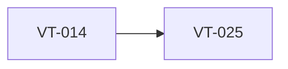

# Implement Greptile review collection and reply workflow

> Harness ID: `VT-025`

> [!IMPORTANT]
> This issue is designed for a lower/medium-effort worker. Do not re-plan the product.
> Execute the prescribed scope, keep the PR focused, and escalate only for material product,
> security, architecture, CI, or UX decisions.

## Outcome

Add scripts or documented commands to collect Greptile findings and prepare fix replies.

## Work Metadata

| Field | Value |
| --- | --- |
| Milestone | M4 Polish And Release Readiness |
| Phase | `phase:4` |
| Parallel Group | `review-automation` |
| Recommended Agent | `agent:codex` |
| Recommended Model | GPT-5.5 via local Codex CLI, low-to-medium reasoning |
| Reasoning Effort | `low` |
| Agent Command | `codex` |
| Dependencies | `VT-014` |
| Labels | `type:implementation`, `area:harness`, `agent:codex`, `phase:4`, `priority:p1`, `ci:required`, `review:cross-agent`, `review:greptile` |

## Dependency View



## Scope

- [ ] Fetch PR reviews/comments with gh and GraphQL where needed.
- [ ] Extract Greptile findings into a machine-readable file.
- [ ] Generate reply text that references fix commit SHA and test command.
- [ ] Document when thread resolution requires human permissions.

## Prescribed Implementation Plan

- [ ] Read docs/requirements.md and relevant ADRs before editing.
- [ ] Inspect existing code and tests before choosing an implementation shape.
- [ ] Implement: Fetch PR reviews/comments with gh and GraphQL where needed.
- [ ] Implement: Extract Greptile findings into a machine-readable file.
- [ ] Implement: Generate reply text that references fix commit SHA and test command.
- [ ] Implement: Document when thread resolution requires human permissions.
- [ ] Verify: Greptile findings can be handed to a fixer agent without manually reading the whole PR.
- [ ] Verify: Reply format includes exact fix commit and explanation.
- [ ] Verify: Permission failures leave actionable status instead of silent failure.
- [ ] Run the issue-specific test command and record the result in the PR.
- [ ] Open a focused PR that closes only this issue unless the issue explicitly says otherwise.

## Expected Files Or Areas

- `docs/harness/**`
- `scripts/**`
- `generated/harness-plan/**`

## Acceptance Criteria

- [ ] Greptile findings can be handed to a fixer agent without manually reading the whole PR.
- [ ] Reply format includes exact fix commit and explanation.
- [ ] Permission failures leave actionable status instead of silent failure.

## Constraints

- Do not make unrelated refactors.
- Do not introduce paid model API calls for orchestration.
- Preserve user changes and generated harness IDs.
- If a decision is low-risk and reversible, use judgment and document it.

<details>
<summary>Failure modes and escalation rules</summary>

- Acceptance criteria are ambiguous after reading the requirements.
- Required local or Windows-side tool is missing.
- Implementation requires a product/security/architecture decision not already recorded.

If one of these occurs, stop and report:

```text
HARNESS_STATUS: blocked
BLOCKER: <specific blocker>
NEEDED_DECISION: <yes|no>
```

</details>

## Review Plan

- [ ] Codex reviews GitHub API correctness.
- [ ] Claude reviews review-status readability.

## CI Expectations

- [ ] Harness validation passes and dry-run output explains required gh commands.

## Notes

- None

## Agent Handoff

When assigned, create a branch named `work/vt-025-implement-greptile-review-collection-and-reply-workflow` and open a PR that links this issue.

Use this worker prompt:

```text
You are working on VT-025: Implement Greptile review collection and reply workflow.

Recommended model/effort: GPT-5.5 via local Codex CLI, low-to-medium reasoning / low.
Primary objective: Add scripts or documented commands to collect Greptile findings and prepare fix replies.

Read:
- docs/requirements.md
- docs/decisions/0001-app-owned-transcription-integration.md
- This issue body

Do only this issue's scope. Make the smallest coherent change. Run the listed CI/test expectations.
Open a PR that closes this issue and include test output plus Greptile/cross-agent review status.
```

Final worker response should include:

```text
HARNESS_STATUS: complete|blocked|needs_review
BRANCH: <branch>
PR: <url-or-none>
SUMMARY: <one line>
```
