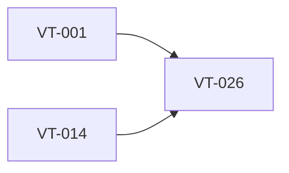

# Add Windows app smoke test strategy and checklist

> Harness ID: `VT-026`

> [!IMPORTANT]
> This issue is designed for a lower/medium-effort worker. Do not re-plan the product.
> Execute the prescribed scope, keep the PR focused, and escalate only for material product,
> security, architecture, CI, or UX decisions.

## Outcome

Define a practical Windows 11 smoke test strategy that is fast enough for CI and useful for release confidence.

## Work Metadata

| Field | Value |
| --- | --- |
| Milestone | M4 Polish And Release Readiness |
| Phase | `phase:4` |
| Parallel Group | `testing-strategy` |
| Recommended Agent | `agent:codex` |
| Recommended Model | GPT-5.5 via local Codex CLI, medium reasoning; escalate to high for architecture/security/API uncertainty |
| Reasoning Effort | `medium` |
| Agent Command | `codex` |
| Dependencies | `VT-001`, `VT-014` |
| Labels | `type:testing`, `area:ci`, `area:windows-app`, `agent:codex`, `phase:4`, `priority:p1`, `ci:required`, `review:cross-agent` |

## Dependency View



## Scope

- [ ] Document unit, integration, UI, packaging, and manual smoke layers.
- [ ] Define which checks run on every PR versus release candidate.
- [ ] Define expected artifacts for UI and packaging checks.

## Prescribed Implementation Plan

- [ ] Read docs/requirements.md and relevant ADRs before editing.
- [ ] Inspect existing code and tests before choosing an implementation shape.
- [ ] Implement: Document unit, integration, UI, packaging, and manual smoke layers.
- [ ] Implement: Define which checks run on every PR versus release candidate.
- [ ] Implement: Define expected artifacts for UI and packaging checks.
- [ ] Verify: Testing strategy avoids hours-long CI runs.
- [ ] Verify: Failures point to likely file/test owner.
- [ ] Verify: Windows-specific checks are separated from fast harness checks.
- [ ] Run the issue-specific test command and record the result in the PR.
- [ ] Open a focused PR that closes only this issue unless the issue explicitly says otherwise.

## Expected Files Or Areas

- `.github/workflows/**`
- `scripts/**`
- `docs/harness/ci-strategy.md`

## Acceptance Criteria

- [ ] Testing strategy avoids hours-long CI runs.
- [ ] Failures point to likely file/test owner.
- [ ] Windows-specific checks are separated from fast harness checks.

## Constraints

- Do not make unrelated refactors.
- Do not introduce paid model API calls for orchestration.
- Preserve user changes and generated harness IDs.
- If a decision is low-risk and reversible, use judgment and document it.
- Keep the implementation native Windows 11; do not introduce Electron or a browser-wrapper shell.
- CI logs must stay segmented and concise; add machine-readable summaries for failures.

<details>
<summary>Failure modes and escalation rules</summary>

- Acceptance criteria are ambiguous after reading the requirements.
- Required local or Windows-side tool is missing.
- Implementation requires a product/security/architecture decision not already recorded.
- CI produces noisy logs or lacks a machine-readable failure artifact.

If one of these occurs, stop and report:

```text
HARNESS_STATUS: blocked
BLOCKER: <specific blocker>
NEEDED_DECISION: <yes|no>
```

</details>

## Review Plan

- [ ] Codex reviews test architecture.
- [ ] Claude reviews UI verification coverage.

## CI Expectations

- [ ] Docs and CI expectations are consistent.

## Notes

- None

## Agent Handoff

When assigned, create a branch named `work/vt-026-add-windows-app-smoke-test-strategy-and-checklist` and open a PR that links this issue.

Use this worker prompt:

```text
You are working on VT-026: Add Windows app smoke test strategy and checklist.

Recommended model/effort: GPT-5.5 via local Codex CLI, medium reasoning; escalate to high for architecture/security/API uncertainty / medium.
Primary objective: Define a practical Windows 11 smoke test strategy that is fast enough for CI and useful for release confidence.

Read:
- docs/requirements.md
- docs/decisions/0001-app-owned-transcription-integration.md
- This issue body

Do only this issue's scope. Make the smallest coherent change. Run the listed CI/test expectations.
Open a PR that closes this issue and include test output plus Greptile/cross-agent review status.
```

Final worker response should include:

```text
HARNESS_STATUS: complete|blocked|needs_review
BRANCH: <branch>
PR: <url-or-none>
SUMMARY: <one line>
```
